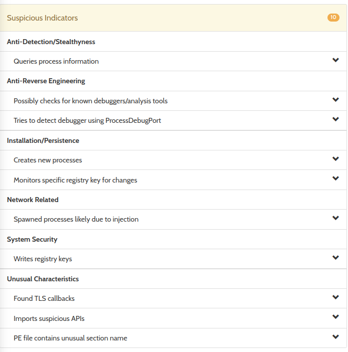

# Exploring Antivirus Detection Rates when Creating a Deadlock Within Dllmain:

This project is my attempt at a proof of concept for how a process could hide malicious behavior by purposely causing a 
dll to fail to load, and then create a deadlock when the dll is attempted to be freed from memory by the operating system.

Here is how it works:

1. The loader (examples/loader) checks to see if dll.dll exists in the executing directory and if not, it writes it to the disk. (this makes it easier for me to upload to virustotal and get a good reading)
2. The loader starts the action thread, which is dormant for now.
3. The loader then calls LoadLibrary() to load up dll.dll into memory, and this causes Dllmain to be called with the DLL_PROCESS_ATTACH parameter
4. Dllmain prints the offset to hello() and then returns 0, causing the operating system to attempt to free dll.dll from memory.
5. When the operating system calls FreeLibrary, Dllmain is called again this time with the DLL_PROCESS_DETACH parameter.
6. Instead of doing what the operating system wants and calmly exiting dllmain, it purposly creates a deadlock, preventing the operating system or anyone else from freeing it. Since Dllmain is in the critical section, no other thread can call loadlibrary or freelibrary.
7. Our action thread wakes up after sleeping for a while, and uses the most unsafe rust code known to man \[citation needed\] to do the following:
   * Find offset to the PEB block in memory, and then get the Ldr parameter of that using inline x64 assembly.
   * Traverses the doubly linked list in memory at Peb->Ldr->IN_MEMORY_ORDER_LINKS until we find the base addr of dll.dll.
   * After finding the base address, we cast it into an IMAGE_DOS_HEADER and use the e_lfanew field to find the NT headers.
   * Within the nt headers we can find the export tables of the loaded dll (name table and function offset table).
   * All of the addresses in the tables are relative to the dll base address.
   * Use slice::from_raw_parts() to iterate through the export table until we find the offset to hello()
8. Our action thread calls hello using inline assembly.

Within hello after it has been called:

1. A call to VirtualProtect is made, marking an encoded payload BUF as read write execute.
2. The xor_repeating_key_encode_in_place function is used to decode the payload with repeating key xor which is not cryptographically safe by any means, but is enough to prevent anti virus from detecting the payload based on heuristics or static analysis.
3. Inline assembly is used to jump to the start of the buffer, and our payload executes.

**CONCLUSION**
This method is definitely a unique approach to antivirus evasion and isnt a novel way of loading a shellcode, but rather 
a way of hiding the presense of a shellcode and obfuscating the decryption process.

I used hybrid-analysis.com to analyze the effect of creating a deadlock in dllmain vs not creating a deadlock in dllmain:

With deadlock: http://www.hybrid-analysis.com/sample/45098cdf0f1d2fa42da3a614423c4ee8b7aea989cd8268ea4d377d3cd69d706a

Without deadlock: http://www.hybrid-analysis.com/sample/2bd826a68e9803451fd6e7d702df680c58b897db8faf1b17e5237a2300208cc6

As of the time of writing, hybrid-analysis does conclude that the program is malicious, although this seems to be partially
due to embedding a dll with include_bytes!() and writing it to disk which is considered suspicious.

Satisfyingly, in the version with a deadlock, hybrid analysis detects much less suspicious behavior when analyzing the dll:

With deadlock: http://www.hybrid-analysis.com/sample/02db9837b4ea8cfc4ab9fd2f73330e180722065b374a9113cb7f6561dd555960/656f84386d854231df0074e3

Without deadlock: http://www.hybrid-analysis.com/sample/2539ea2e090916f05d6f8ccb2725e1d8cc5f6d7c62123ec1355054243e48328d/656f8340f4226defe90e6a3f

As you can see it detects creation of new processes and processes spawned due to injection:\

And with the deadlock, no process creation is detected:\

This failure to detect the shellcode loading can be almost definitely attributed to the thread deadlock, as after the call
to loadlibrary fails and the infinite loop in Dllmain starts, no other thread can enter the critical section. This can 
actually be observed when executing the program using run.sh, which uses wine to execute the program on linux:
002e:err:ntdll:RtlpWaitForCriticalSection section 0x7bd017c0 "loader.c: loader_section" wait timed out in thread 002e, blocked by 002c, retrying (60 sec)
